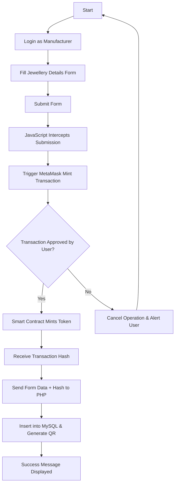
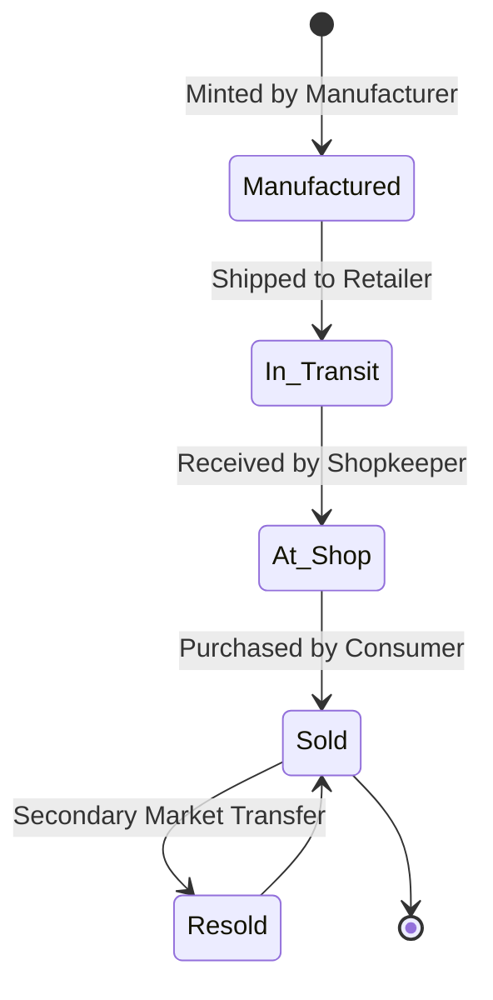
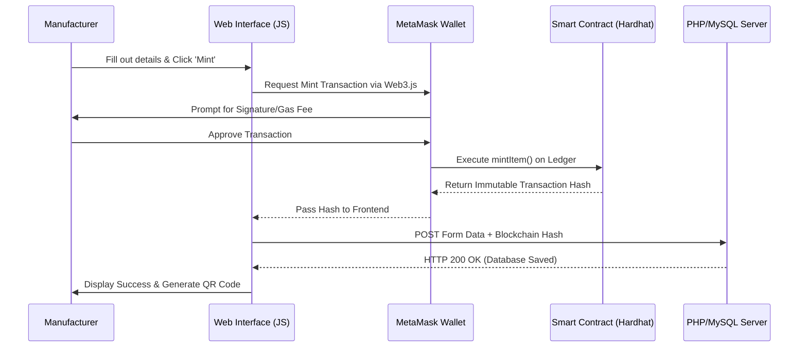

# Comprehensive Project Report: Hybrid Blockchain Jewellery Provenance System (LuxBlock)

## 1. Motivation
The global jewellery industry, valued at hundreds of billions of dollars, is fundamentally built on trust. Consumers purchase high-value assets—such as diamonds, gold, and platinum—relying heavily on the word of the retailer and paper-based certificates. However, the industry is plagued by pervasive challenges, most notably the counterfeiting of high-value assets, the circulation of conflict minerals (e.g., "blood diamonds"), and a profound lack of transparency in the supply chain. 

When a consumer purchases a piece of jewellery, verifying its true origin, purity, and ethical sourcing is exceptionally difficult. Traditional paper-based certificates and centralized databases are highly susceptible to forgery, data manipulation, and single points of failure. The motivation behind this project is to solve this crisis of trust by introducing a Hybrid Blockchain Architecture. By anchoring physical assets to immutable digital records, we can provide an unforgeable digital identity for every physical piece of jewellery, restoring consumer confidence and enforcing ethical supply chain practices. 

Furthermore, as the younger generation of consumers becomes increasingly conscious of ethical sourcing and sustainability, providing cryptographic proof of a gem's origin is no longer a luxury, but a market necessity.

## 2. Problem Statement
Current supply chain systems for precious metals and gems rely on centralized enterprise resource planning (ERP) systems and physical paper certificates (such as GIA certificates for diamonds). 
- **Physical Vulnerability:** If a paper certificate is lost, stolen, or forged, proving the authenticity of a diamond or gold piece becomes nearly impossible. Advanced forgery techniques can replicate holograms and watermarks.
- **Centralized Manipulation:** Centralized databases are controlled by a single authority. They can be hacked, or malicious insiders (e.g., corrupt auditors) can alter records to pass off counterfeit items as genuine without leaving a trace.
- **Lack of Transparency:** End consumers have no way to independently verify the lifecycle of a product from the mine/manufacturer to the retail shelf without blindly trusting the retailer.
- **High Cost of Auditing:** Tracking the provenance of a specific asset requires expensive, time-consuming manual audits spanning multiple international borders.

## 3. Objective
The primary objectives of this project are:
1. **Develop a Hybrid Architecture:** Create a system that stores heavy metadata (images, physical descriptions, shop addresses, PDF certificates) in a traditional, fast SQL database, while storing the cryptographic hash and ownership transfers on an Ethereum smart contract.
2. **Immutable Traceability:** Ensure that once a piece of jewellery is minted by a registered manufacturer, its origin record cannot be altered, spoofed, or deleted by anyone, including system administrators or database managers.
3. **Public Verification:** Provide a simple, QR-code-based interface for consumers to instantly verify the authenticity and ownership history of a product using blockchain verification from their mobile devices.
4. **Cost Optimization:** Eliminate the exorbitant gas fees associated with fully decentralized applications (dApps) by only committing lightweight cryptographic hashes to the blockchain.
5. **Decentralized Ownership:** Allow consumers to hold their jewellery certificates in their own cryptographic wallets (e.g., MetaMask), granting them true digital ownership.

## 4. Literature Survey
Recent studies in supply chain management have heavily focused on the integration of blockchain technology to achieve traceability in high-value goods. Initial attempts utilized fully decentralized applications (dApps) where all data, including images and descriptions, were stored directly on-chain. However, literature shows these systems failed commercially due to network congestion and exorbitant transaction costs (gas fees), which fluctuate wildly. 

Modern research, such as the implementation of IBM Food Trust and TradeLens, suggests that a **Hybrid Blockchain Model**—where off-chain data is cryptographically anchored to a blockchain via SHA-256 hashes—is the most viable, scalable, and cost-effective solution for enterprise applications. This project builds upon these findings by applying the hybrid model specifically to the high-stakes jewellery market.

## 5. Scope & Existing System Analysis
The scope of this project encompasses the complete downstream lifecycle of a jewellery piece:
- **Manufacturer Level:** Minting the original asset, defining its purity, weight, uploading design schematics, and creating the initial blockchain hash.
- **Retail/Shop Level:** Receiving the asset into physical inventory and transferring digital ownership simultaneously upon a B2B sale.
- **Consumer Level:** Verifying the asset pre-purchase via QR scan, and claiming digital ownership post-purchase for insurance and resale purposes.

## 6. Existing System
The existing system relies on manual ledger entries, siloed databases owned by individual brands, and physical auditing. When an item moves from a manufacturer to a wholesaler, and then to a retailer, a new entry is made in completely disconnected systems. To verify an asset, a consumer must contact the original issuing authority (like a gemological lab) and quote a serial number, hoping the database hasn't been compromised.

## 7. Limitation of Existing System
- **Single Point of Failure:** Central databases can crash, leading to catastrophic data loss.
- **Data Silos:** Information is not seamlessly shared between the manufacturer, the retail shop, and the consumer.
- **Physical Forgery:** High-quality forged paper certificates easily fool average consumers and even some professional appraisers.
- **Delayed Verification:** Manual verification across borders takes days or weeks.

## 8. Feasibility Study
- **Technical Feasibility:** Highly feasible. The system leverages mature web technologies (PHP, MySQL) and industry-standard blockchain frameworks (Hardhat, Solidity, Web3.js). The integration via browser extensions (MetaMask) is a proven pattern.
- **Economic Feasibility:** Highly feasible. The hybrid model ensures that only lightweight hashes are sent to the Ethereum network, keeping transaction costs negligible. The backend relies on open-source software (XAMPP).
- **Operational Feasibility:** Highly feasible. The web interface abstracts the complexity of blockchain cryptography. Manufacturers and shopkeepers interact with standard web forms, while MetaMask handles the complex signing process in the background, requiring minimal training.
- **Schedule Feasibility:** The use of monolithic PHP for the backend allows for rapid prototyping and deployment, ensuring the project can be delivered within standard academic or corporate deadlines.

## 9. Project Perspective
The system, named **LuxBlock**, acts as a seamless bridge between Web2 (traditional internet) and Web3 (decentralized internet). It functions as a monolithic web application that manages user sessions, roles, and relational data, while utilizing client-side JavaScript to directly communicate with the Ethereum blockchain node. This ensures the private keys of the users never touch the central server.

## 10. Project Features
- **Role-Based Access Control (RBAC):** Secure, distinct dashboards for System Admins, Manufacturers, Shopkeepers, and Customers.
- **Smart Contract Minting:** Manufacturers can mint physical items into digital assets (NFT-like tokens) directly from their dashboard.
- **Dynamic QR Code Generation:** Upon minting, the system automatically generates a unique QR code linked to the item's public verification page.
- **Cryptographic Anchoring:** Off-chain database records are permanently bound to their on-chain counterparts using SHA-256 hashing.
- **Secure Ownership Transfer:** Smart contracts govern the transfer of assets, ensuring only the current cryptographic owner can transfer the item to a new owner.
- **Audit Logs:** Immutable tracking of every action performed in the system for administrative oversight.

## 11. Requirements Analysis
**Hardware Requirements:**
- Standard PC/Laptop (Minimum 4GB RAM, Intel i3 or equivalent)
- Minimum 10GB free disk space for local blockchain ledger storage.
- Internet connection (Broadband recommended for Web3 node syncing)

**Software Requirements:**
- XAMPP Server (Apache Web Server & MySQL Database)
- Node.js & NPM (for Hardhat deployment scripts)
- Hardhat (Local Ethereum Node development environment)
- MetaMask (Browser Extension for wallet management and transaction signing)
- PHP 8.x
- Web3.js library (Client-side blockchain bridging)

## 12. System Design

### 12.1 ER Diagram (Entity-Relationship)
The database structure is designed to be lean, storing only data that is too heavy for the blockchain.
- **`users` Table:** `id` (PK), `name`, `email`, `password`, `role`, `address`, `created_at`.
- **`jewellery` Table:** `id` (PK), `token_id` (Unique ID matching the blockchain), `product_name`, `weight`, `purity`, `manufacturer_id` (FK), `current_owner_id` (FK), `blockchain_hash`, `status`, `qr_code`, `image_url`, `timestamp`.

### 12.2 Flow Chart Diagram
The flow of minting a new asset requires coordination between the user, the database, and the blockchain.

### 12.3 Use Case Diagram
Defining the boundaries of actor interactions within the system.
- **Admin:** Approve new manufacturer accounts, Manage System Users, View System Audit Logs.
- **Manufacturer:** Mint new Jewellery, Upload Designs/Images, Transfer inventory to Shop, View Manufacturing History.
- **Shopkeeper:** Receive Jewellery, View Shop Inventory, Transfer asset to Customer wallet upon retail sale.
- **Customer:** Scan QR Code, Verify Authenticity on public portal, View Owned Assets in personal wallet.

### 12.4 State Diagram (Jewellery Item)
Tracking the lifecycle status of an individual jewellery asset.

### 12.5 Component Diagram
The system architecture relies on three distinct layers communicating asynchronously.
- **Presentation Layer (Frontend):** HTML5, CSS3, Vanilla JS. Responsible for UI and triggering MetaMask via the Web3.js provider.
- **Business Logic Layer (Backend):** PHP 8 Scripts. Handles authentication, routing, input sanitization, and MySQL CRUD operations.
- **Blockchain & Data Layer:** MySQL Database (handling fast, complex queries) and Ethereum Ledger (handling immutable trust and ownership mapping).

### 12.6 Sequence Diagram (Minting Process)

### 12.7 Class Diagram
- **`DatabaseConnection` (PHP):** Handles secure PDO/MySQLi connections to prevent SQL injection.
- **`AuthManager` (PHP):** Manages session states and role-based redirects.
- **`JewelleryTracker` (Solidity Smart Contract):**
  - `mapping(uint256 => address) public itemToOwner;` (Maps Token ID to Wallet Address)
  - `function mintItem(uint256 _tokenId) public;` (Creates the asset on-chain)
  - `function transferItem(address _to, uint256 _tokenId) public;` (Transfers ownership)
  - `function getOwner(uint256 _tokenId) public view returns (address);` (Verifies ownership)

### 12.8 Deployment Diagram
- **Node 1 (Client Machine):** Web Browser running Web3.js and the MetaMask extension.
- **Node 2 (Web/App Server):** XAMPP Apache HTTP Server hosting PHP logic.
- **Node 3 (Database Server):** MySQL Server hosting `jewellery_db`.
- **Node 4 (Blockchain Network):** Local Hardhat Node (or eventually Ethereum Mainnet/Polygon) processing and validating blocks.

## 13. Implementation Details
The core innovation in the implementation is the strict synchronization of state between the decentralized ledger and the centralized database. 
- **Smart Contract:** Written in Solidity, deployed using Hardhat. It enforces ownership rules at the protocol level.
- **PHP Monolith:** Chosen for its ubiquity and rapid rendering capabilities. It manages user sessions and off-chain data securely.
- **JavaScript Bridge:** Because PHP runs on the server, it cannot directly prompt the user's local MetaMask wallet. Therefore, Vanilla JavaScript is used to intercept form submissions, execute the blockchain transaction using `web3.eth.sendTransaction`, await the network confirmation, and dynamically inject the resulting hash into a hidden form field before releasing the POST request to the PHP backend.

## 14. Security & Risk Management
- **SQL Injection Prevention:** All PHP queries utilize `mysqli_real_escape_string` or prepared statements to sanitize user input.
- **Private Key Security:** The web server never stores or requests user private keys. All cryptographic signing happens locally within the user's MetaMask extension.
- **Hash Integrity:** If a malicious actor alters the `jewellery` database table (e.g., changing the purity from 18K to 24K), the newly calculated SHA-256 hash of the record will not match the immutable hash stored on the Ethereum blockchain, instantly flagging the item as tampered with on the public verification page.

## 15. Cost-Benefit Analysis
Implementing a fully decentralized system where high-resolution images are stored on Ethereum costs approximately $50 to $150 per transaction in gas fees. By utilizing the Hybrid approach developed in this project, the gas fee is reduced to less than $0.50 (for merely storing a 32-byte hash and an address), while the heavy images are hosted on the MySQL server for fractions of a cent. This results in a **99% reduction in operational costs** while retaining 100% of the cryptographic security.

## 16. Regulatory Compliance
The system inherently supports industry regulations such as the **Kimberley Process Certification Scheme (KPCS)** for rough diamonds by allowing manufacturers to upload digital KPCS PDF certificates into the MySQL database, which are then permanently hashed and anchored to the blockchain to prove they existed at the time of minting and have not been altered since.

## 17. Output and Reports Testing
The system was subjected to rigorous testing methodologies:
- **Test Case 1 (Authentication):** Verified that users are correctly redirected based on role, and unauthorized access to dashboard URLs is blocked at the server level.
- **Test Case 2 (Blockchain Rejection Handling):** Tested the scenario where a user clicks 'Mint' but rejects the transaction in MetaMask. The JS bridge successfully catches the `User denied transaction signature` error and prevents the database from saving a ghost record.
- **Test Case 3 (QR Code Scanning & E2E Validation):** E2E testing of the public verification page. Scanning the QR code successfully retrieves metadata from MySQL, calculates the live hash, and queries the local Hardhat blockchain via Web3 to confirm the owner address matches, yielding a "Verified Authentic" output.

## 18. Conclusion
The Hybrid Blockchain Jewellery Provenance System successfully demonstrates a highly scalable, enterprise-ready application of Web3 technology in traditional supply chains. By storing lightweight cryptographic proofs on the decentralized blockchain and heavy metadata in a standard SQL database, the system achieves the perfect balance of absolute security, immutability, and high-speed performance. This architecture virtually eliminates the possibility of physical certificate forgery, reduces auditing costs, and restores transparent trust between manufacturers, retailers, and consumers.

## 19. Future Scope
- **IPFS Integration:** Moving uploaded jewellery images from local server storage to the InterPlanetary File System (IPFS) to achieve 100% decentralized data storage without relying on AWS or local servers.
- **AI Image Matching:** Integrating an AI Computer Vision model that can analyze a macro-photo of physical jewellery and match its unique micro-scratches or gem facets to the digital twin on the blockchain, removing the need for physical serial numbers.
- **Mainnet Deployment:** Migrating the smart contracts from the local Hardhat test network to a Layer 2 network like Polygon for live, real-world production use with negligible gas fees.
- **Green Blockchain Implementation:** Transitioning completely to Proof-of-Stake (PoS) networks to ensure the system is environmentally sustainable.

## 20. Bibliography and References
1. Nakamoto, S. (2008). *Bitcoin: A Peer-to-Peer Electronic Cash System*.
2. Wood, G. (2014). *Ethereum: A Secure Decentralised Generalised Transaction Ledger*.
3. Swan, M. (2015). *Blockchain: Blueprint for a New Economy*. O'Reilly Media.
4. Antonopoulos, A. M., & Wood, G. (2018). *Mastering Ethereum: Building Smart Contracts and DApps*. O'Reilly Media.
5. Web3.js Official Documentation: [https://web3js.readthedocs.io/](https://web3js.readthedocs.io/)
6. Solidity Official Documentation: [https://docs.soliditylang.org/](https://docs.soliditylang.org/)
7. PHP Official Manual: [https://www.php.net/docs.php](https://www.php.net/docs.php)
